# Lab No 4: Examine Global Poverty Using UN SDGs {.unnumbered}

## Overview

Have you ever considered where pockets of poverty exist and who is most affected? Unfortunately, global trends show that children are most impacted by poverty. Around the world **385 million children** live in extreme poverty, and in 2013 the World Bank found that **19.5 percent of children** in 89 countries lived in a household that survived on U.S. \$1.90 per day per person or less.

**Estimated time of completion:** 70 Minutes

## Learning Outcomes

By completing this tutorial, you should be able to:

-   **Access and download** UN SDG data from official portals
-   **Prepare and clean** spatial data for analysis
-   **Create feature layers** in ArcGIS Online through geocoding
-   **Perform spatial joins** to combine multiple datasets
-   **Create choropleth maps** to visualize quantitative data
-   **Develop bivariate maps** to compare multiple indicators
-   **Configure effective pop-ups** and legends for data communication
-   **Apply spatial analysis techniques** to real-world policy questions

These skills are transferable to many other contexts, including local and national policy analysis, environmental monitoring, public health studies, and economic development planning.

------------------------------------------------------------------------

## Why is poverty such a critical issue?

Because it relates to the overall well-being of a person. Those living in poverty may lack access to basic food, housing, and healthcare. Growing up without consistent nutrition, shelter, and safety can have long-lasting developmental impacts on children and can cause lifelong problems.

> **Scottish Context**: In Scotland, child poverty affects approximately 24% of children (around 240,000 children), with particular concentrations in areas like Glasgow, Dundee, and parts of Edinburgh. The Scottish Government has committed to reducing child poverty to less than 10% by 2030 through the Child Poverty (Scotland) Act 2017.

In 2015, the United Nations and world leaders developed a series of goals to improve situations for people, places and environments globally. In total, there are **17 Sustainable Development Goals** that nations are striving to meet by 2035. This activity focuses on **Goal 1: No Poverty** and corresponding indicators that can be used to measure poverty.

## Protecting Children with UN Sustainable Development Goals

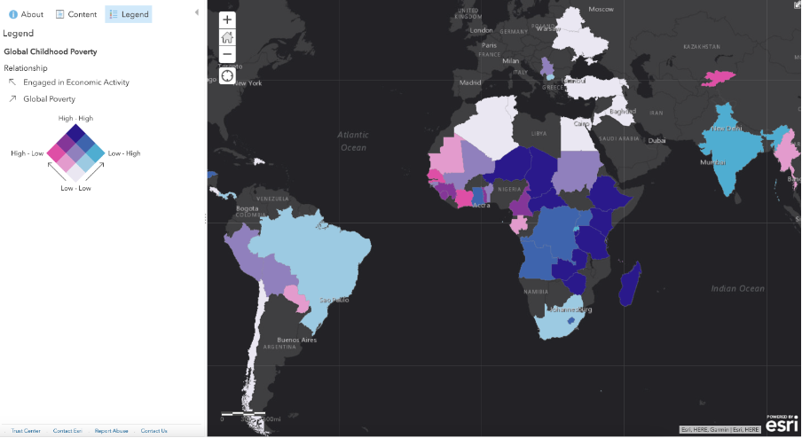

------------------------------------------------------------------------

## Step 1: Visualize Global Poverty

Sustainable Development Goal 1, **"No Poverty"** is achieved when we "End poverty in all its forms everywhere," and "should be understood as deprivation beyond the lack of income and resources to ensure a sustainable livelihood."

> **Key Definition**: Poverty is felt through hunger, malnutrition, limited access to basic services and educational opportunities, social discrimination and exclusion. In order to secure a future of sustainable economic growth, it is essential for countries to promote economic equality.

### Task 1.1: Understanding SDG Goal 1

1.  Visit the [UN Sustainable Development](https://www.sdg.org/) site.

    Most of the data for the Sustainable Development Goals is curated and maintained by the UN Statistics Division. There are also countries that host their own open data portals featured on the data page.

2.  Scroll down and find the section called **Sustainable Development Goals**, click the first goal, **No Poverty**.

3.  **Familiarize yourself** with this goal - take some time to understand **what this goal is about** and **why it is the first goal**.

    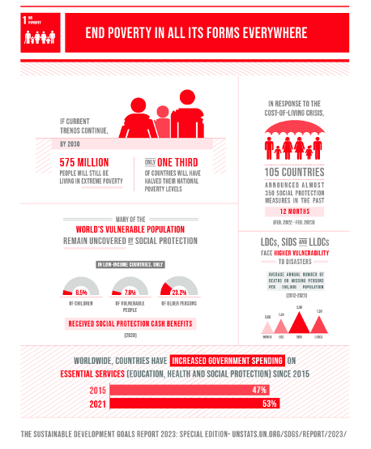

> **Scottish Policy Example**: Scotland's approach to SDG 1 includes the Scottish Child Payment (£25 per week per child under 16), free school meals, and targeted support for families in the most deprived areas. The Scottish Index of Multiple Deprivation (SIMD) is used to identify areas requiring priority intervention.

### Task 1.2: Accessing UN Data Portal

4.  After you get a better understanding about the main facts that you can measure within this goal, now let's apply the geographical approach to create web maps and apps that help you represent spatial data related to this goal.

    Go to <https://unstats.un.org/sdgs/dataportal/database> and get the data related to the **1.1.1 indicator**. Which corresponds to **Proportion of population below international poverty line (%) --\> \$2.15 per day**. Once you are in the portal, follow the next options to get the required data.

5.  In the **Data Series** type or select the **1.1.1** Indicator, in the **Countries, areas or Regions** section, click on **Countries or Areas**, and for **Period** make sure you selected only the **2017** year. (you should have around 783 observations). Click **Show Results**.

    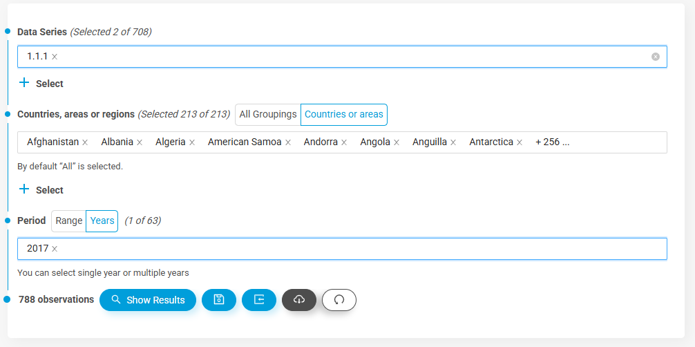{width="562"}

**Expected Result**: You will see a couple of tabs open up at the bottom corresponding to: - **Proportion of population below international poverty line (%) SI_POV_DAY1** - **Employed population below international poverty line, by sex and age (%) SI_POV_EMP1** indicators

Expand the **SI_POV_DAY1** tab. At this point you should have a preview of a table that includes countries and 2017 poverty values. Now click **Download XLS**.

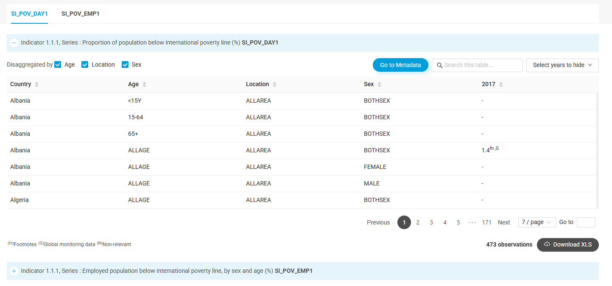{width="591"}

### Task 1.3: Data Preparation

6.  **Open the downloaded file** - you will see several countries are duplicated, due to data being collected at different scales (e.g., Sex, Location, Age). **Filter** the data to show only:

    -   **Sex**: BOTHSEX
    -   **Location**: ALLAREA
    -   **Age**: ALLAGE

    Now you should have **77 records**.

7.  Save the filtered table **as a new file** but in **a CSV format** (name it as `1_1_1_indicator_filtered.csv`).

    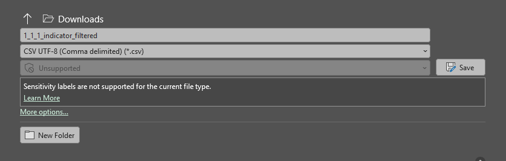{width="527"}

> **Important Note**: Data filtering is crucial for accurate spatial analysis. In Scotland, similar filtering would be applied when working with data from the Scottish Government's statistics portal, ensuring consistency across geographic areas and demographic groups.

### Task 1.4: Creating a Feature Layer in ArcGIS Online

7.  Go to **ArcGIS Online**, sign up with your university credentials and go to **Content**. Now you will upload the filtered Excel file and create a **Feature Layer** with the data you downloaded and filtered.

8.  Click **New Item**

    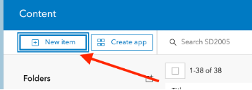

9.  **Drag and drop** your file or choose **Device** option and select the filtered CSV file (e.g., `1_1_1_indicator_filtered.csv`)

10. When ArcGIS Online asks **"How would you like to add this file?"** Select the first option: ***Add and create a hosted feature layer or table***. Click **Next**.

11. In the **Field Box**, the 13 columns are selected - no need to do anything here, just click **Next**.

12. In the **Location Settings**, select **Addresses or place names**. Open the **Advanced location settings** and select **World** in the **Region** box. Now in **Location fields**, make sure **Location information is in one field** is selected. Then in front of **Address or Place**, select the Field **GeoAreaName**, click **Next**.

    > ::: callout-important
    > **⚠️ Credit Usage Warning**: **You will use approximately 3 Credits** from your ArcGIS Online Account for this geocoding process. If you see you are using more credits cancel and double check, as you are probably uploading and geocoding the wrong file. **Each student has a limited quota of credits, and the University cannot provide you with more credits if you accidentally use more than the estimated and required credits.**
    > :::

13. Finally, provide a **title**, **tag**, and **summary** of the feature layer you are creating. Click **Save**.

14. ArcGIS Online will host your Excel file, geocode all the rows based on the name of the country (that's why it uses credits) and then create a feature layer (the spatial data) that you can use to create web maps based on that indicator.

15. If you get a warning/notification, please click **YES**.

    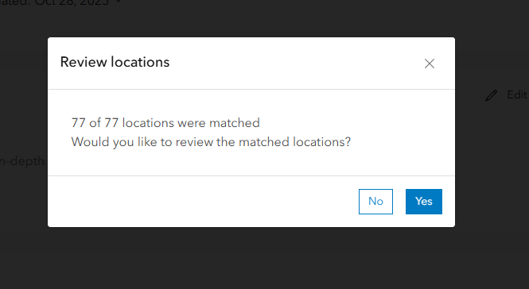{width="519"}

    ::: callout-warning
    This indicates how many rows or locations were geocoded. If you have included more than 77 locations, you probably geocoded the wrong file. You need to cancel, remove that file from ArcGIS Online, and repeat the process, ensuring you select the correct filtered CSV file. You have a limited number of credits for this lab, and the University cannot provide you with more.
    :::

### Task 1.5: Correcting Geocoding Errors

> **Common Issue**: One common problem in geocoding when using names is that you could get locations in places that do not correspond to the intended place. ArcGIS Online provides a way to correct those mislocated places.

16. Once you have the Map Viewer open, you will a warning pop-up window describing a new version of ArcGIS Online, click **Not Right Now**

    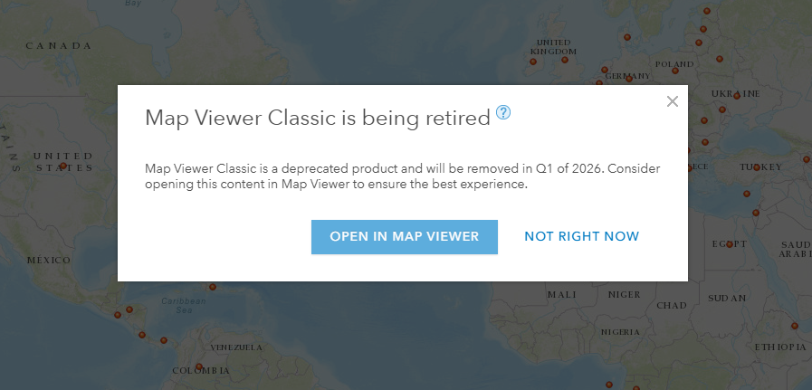{width="576"}

17. you will notice that **Georgia** has been automatically coded to be in the USA.

    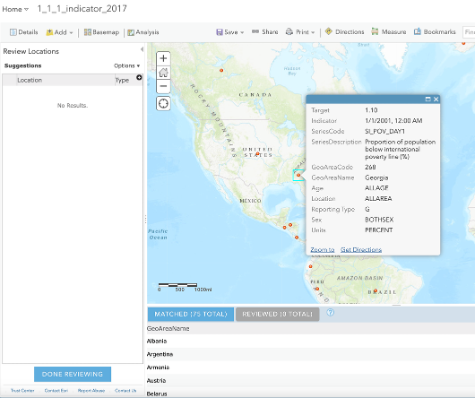

18. Using the table at the bottom, locate **Georgia** and select it. You will see on your left a list of all the potential candidates that ArcGIS Online used to geocode Georgia. If you click on the **third option**, you will realize that one is the correct match (the country Georgia, not the US state). Click **Match** and then **Done Reviewing**.

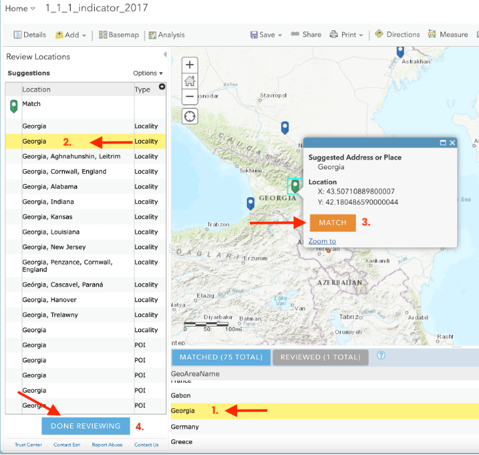

> **Scottish Example**: Similar geocoding issues might occur with place names like "Perth" (which could be matched to Perth, Australia instead of Perth, Scotland) or "Hamilton" (which might be matched to Hamilton, Canada instead of Hamilton, Scotland).

18. Once your geocoding process has finished, your map should look like this:

    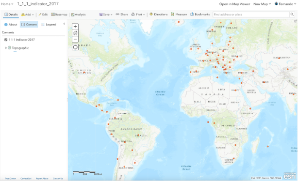

::: callout-important
**NOTE**: If that does not work and Georgia point is still located in the USA. **We need to Edit the layer and do it manually**, unfortunately this can be a bug or glitch in the system and is very common when you work with these type of tools, so you need to adapt and find alternative solutions.
:::

### Edit a Layer

Click in **Open in Map Viewer** to open the new **Map Viewer Editor.**

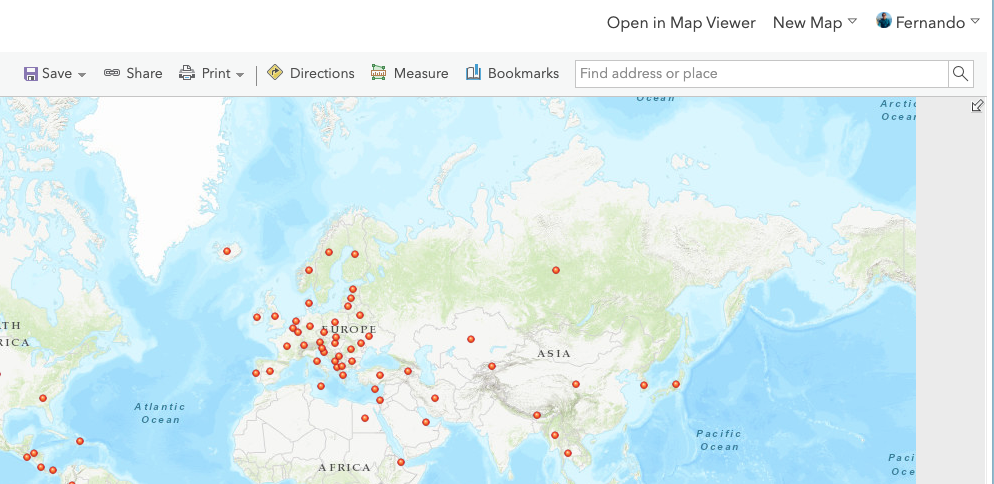

Once the map open with the new Map Viewer and the layer has displayed. Find the Georgia Point located in the USA and click on it to open the Pop-up window, click in Edit.

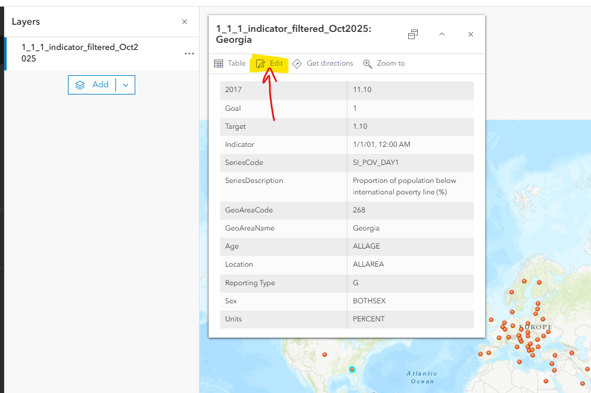

Move it to the right location and click **Update**.

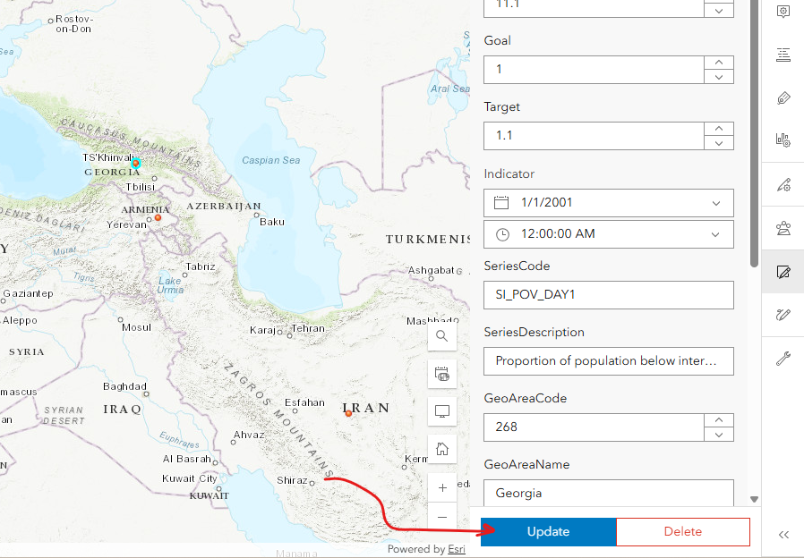{width="646"}

Save the map. Click **Save** to save the current web map to your account. Add the title: **"Indicator 1.1.1: Proportion of population below the international poverty line (percent)"**

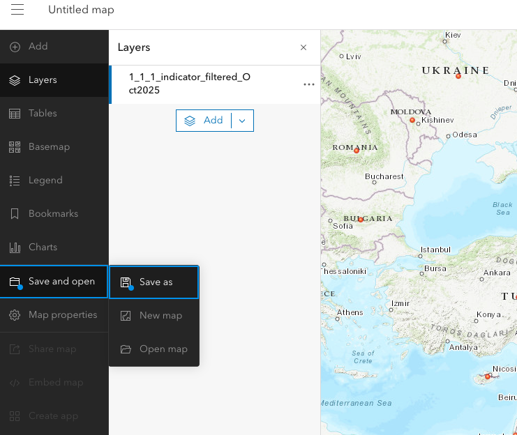

**Observation**: You will notice that most of the African countries have not reported any data, but here is when we can use and merge other data sources. We can use data reported by the [World Bank](https://data.worldbank.org/indicator/SI.POV.GAPS?most_recent_value_desc=true&type=shaded&view=map&year=2004) to merge with the data you have geocoded.

### Task 1.6: Adding Additional Data Sources

19. Click **Add** and **Search For Layers** to look for a published service. Make sure you have **My Organization** selected, and then type `latest_africa_poverty_data`, and **add** the layer published by *mfbp1_UoStAndrews*.

    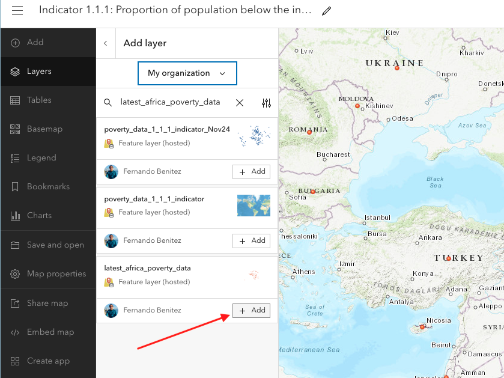{width="500"}

20. You will see now your map has two layers.

    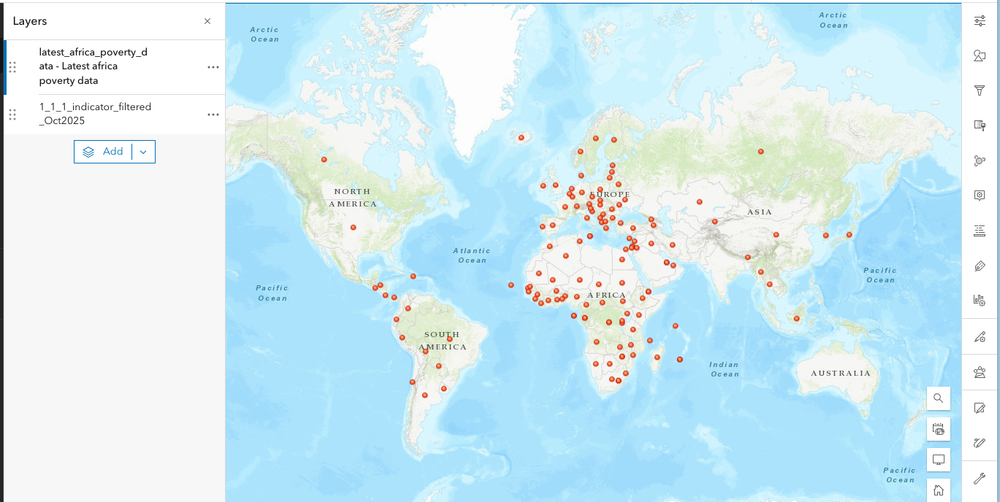

21. Find the toolbar at your right and click in **Analysis**., then **Tools**.

    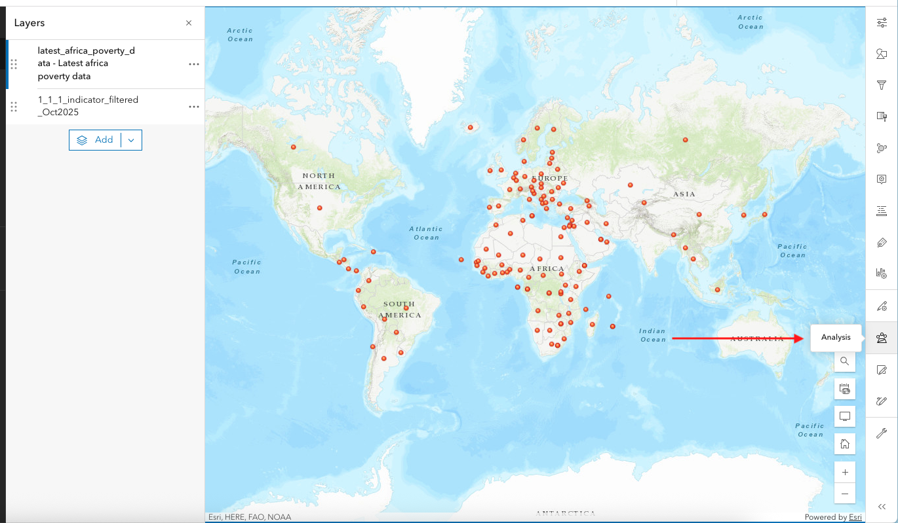

22. Then in **Manage Data**, select **Merge Layers**.

    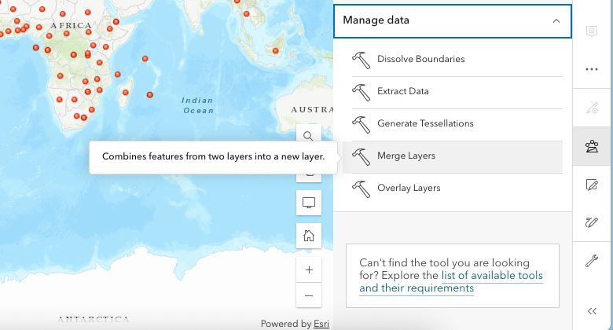

23. Select `latest_africa_poverty_data` as **Input Layer**, and `1_1_1_indicator_filtered` as **Layer to Merge**. Click **Run**.

    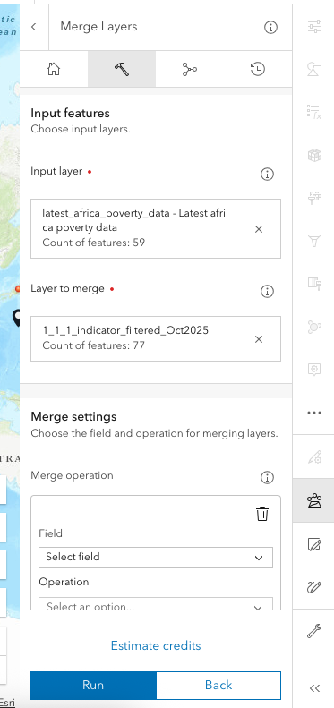

**Processing Note**: Give ArcGIS Online some time to process your analysis, and you will have a single layer that joins the poverty data for most of the countries.

> **Technical Tip**: A key aspect you need to consider for future data joins is ensuring how the attributes will be joined. In this case, both poverty values are included as integers and the heading is called "2017", which has allowed us to have one single column with the values we need to plot a **world poverty map**.

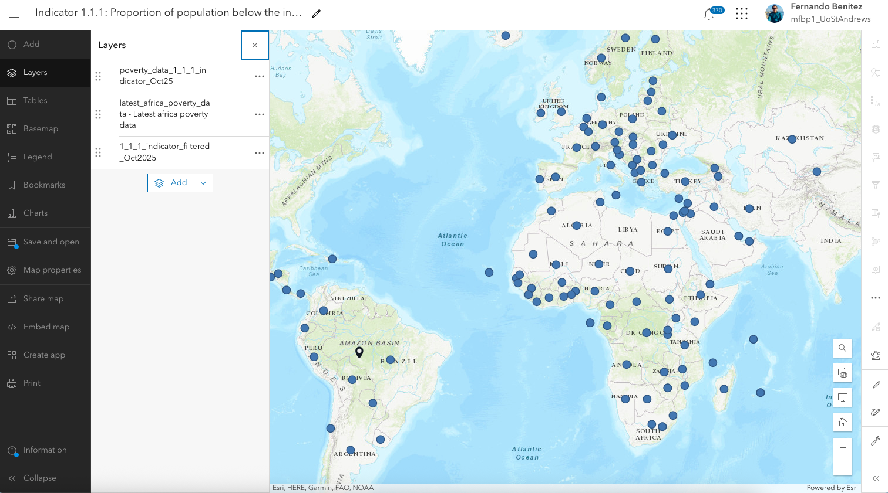

23. Click **Save** to save the current web map to your account.

### Task 1.7: Converting Points to Polygons

**Current Issue**: The data appears as points, but to better visualize it, the data should be converted to polygons.

24. On the ribbon **Layers**, click **Add**, then click **Living Atlas Layers**. Search for "***world countries***" and add one of Esri's World Countries layers by clicking the plus.

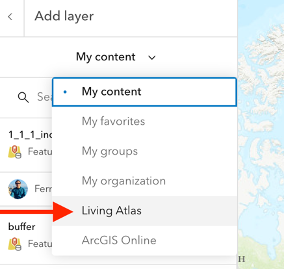

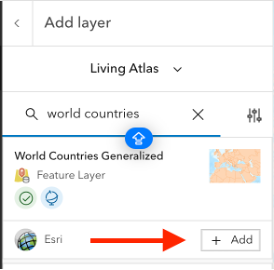

25. Click the back arrow to close the pane. In the **Contents** pane, re-position the World Countries Generalized Layer under the merge layer and click the **Analysis** button again.

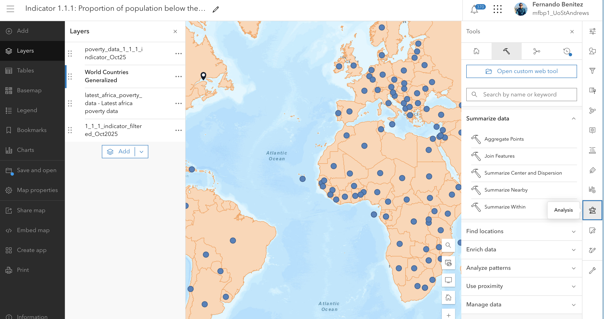

25. On **Analysis** pane, expand **Summarize Data**, then click **Join Features**.
26. Configure the join as follows:
    -   **Choose target layer**: Set to **World Countries**

    -   **Choose Join Layer** the **Indicator 1.1.1 layer**

    -   **Select the type(s) of join**: Click **Choose a spatial relationship** and choose **Intersects**

    -   **Choose join operation**: Make sure **Join one to one** is selected

    -   Leave the other options as they are

        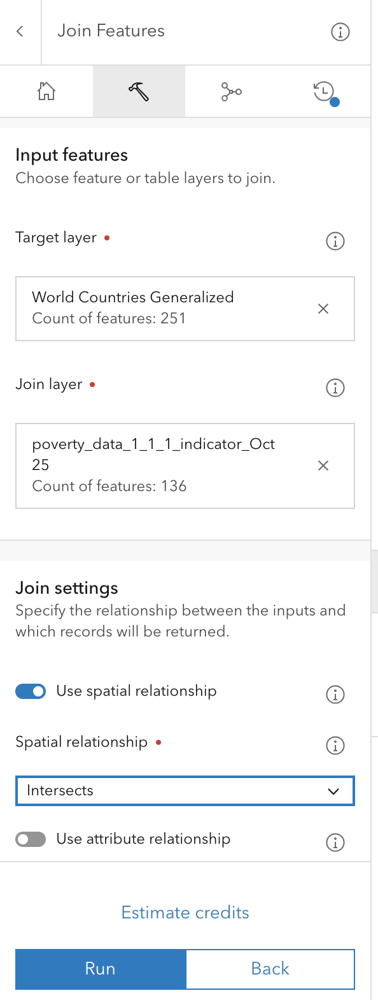{width="304"}

<!-- -->

28. Name the output layer as **World Poverty**, and click **Run**.

**Result**: When the analysis finishes, the layer will be added to the map. By default, all the countries are shown in the same color. To see the data, you'll change the symbology to show a choropleth map.

### Task 1.8: Creating a Choropleth Map

29. **Uncheck all layers** except for **World Poverty**, then click over the **World Poverty layer** and click the **Style** button.

    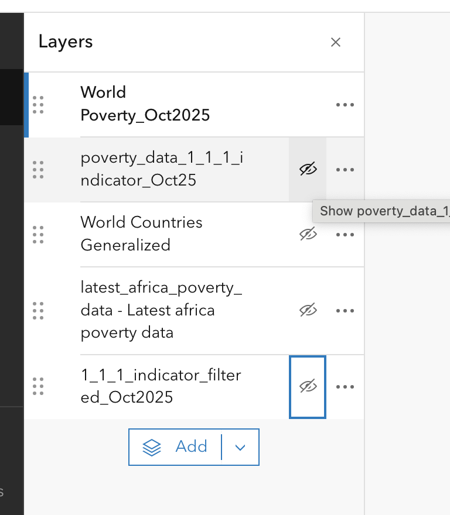{width="306"}

<!-- -->

30. On the **Style** pane, click on **Field** to choose an attribute to show menu and choose **2017**.

    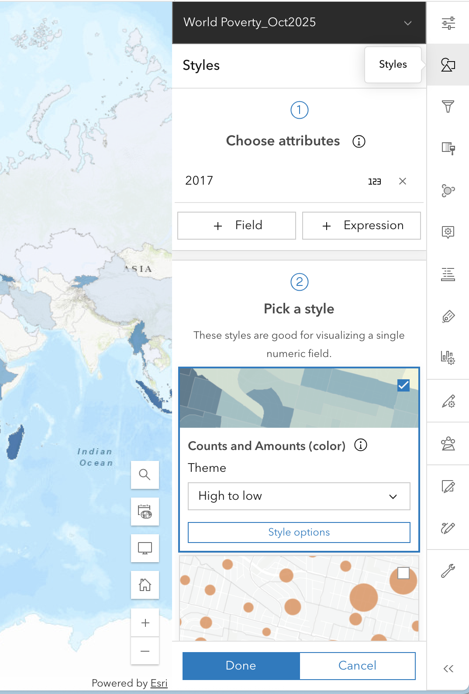{width="510"}

**Understanding the Data**: "2017" is the attribute that shows the latest reported value for any country that has reported data. The countries are symbolized with a default graduated color scheme that shows low values in light yellow and high values in dark blue. The light yellows blend into the basemap, so before analyzing the map, you'll change the symbology.

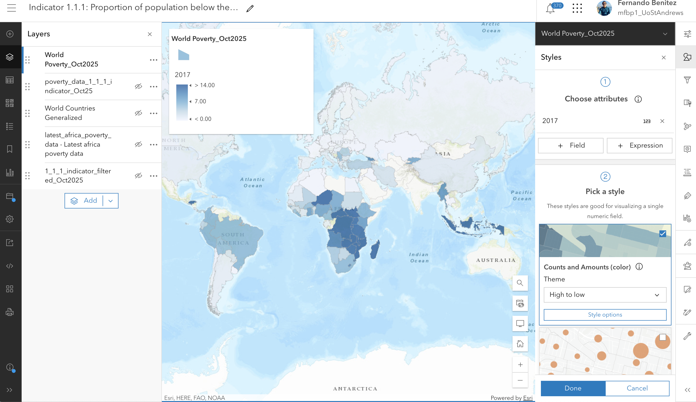

31. For **Counts and Amounts (Color)** make sure the Theme High to Low is selected.

### Initial Analysis Results

**Visual Analysis Findings**: From a visual analysis, it appears that: - **Europe, North America, and South America** (partially) have the **lowest levels of poverty** - **Several African countries** report **high levels of poverty** - **Some countries** (such as Libya and Saudi Arabia) **haven't reported data** for this metric

> **Scottish Context**: Scotland, as part of the UK, would appear in the low poverty category on this global map, but this masks internal variations. Areas like the Glasgow conurbation, parts of Dundee, and some rural Highland communities experience higher poverty rates that would be visible in a more detailed, national-scale analysis.

32. Click **OK**, then **Done** and **save the map**.

> **⚠️ Important Reminder**: Always remember to save your map - ArcGIS Online does not automatically save your work, so constantly remember to save your progress!

------------------------------------------------------------------------

## Step 2: Compare Child Poverty

Now that you've mapped global poverty, you'll map reported data for **percentage of children involved in economic activity**. This indicator is measured with the goal of eradicating forced labor and ending modern slavery and use of child soldiers.

### Task 2.1: Adding Child Labor Data

1.  On the ribbon, click **Add** and choose **Search for Layers**. (At this point you should know how to do it)

2.  Click **My Content** and choose **My Organization**, then search for ***8.7.1***

3.  Click the **plus** to add the result **Indicator 8.7.1: Proportion of children engaged in economic activity, by sex and age (percent)** to the map.

    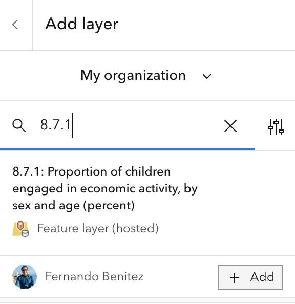{width="334"}

### Task 2.2: Joining Child Labor Data with Poverty Data

4.  Select the **World Poverty** layer and click **Analysis**.

5.  Expand **Summarize Data** and choose **Join Features**. Enter the parameters as follows:

    -   **Choose target layer**: World Poverty
    -   **Choose layer to join to target layer**: Indicator 8.7.1
    -   **Join type**: Spatial relationship -- Intersects
    -   **Join operation**: one to one
    -   **Result layer**: *Childhood Poverty*

6.  Click **Run**.

7.  **Turn off** all layers except for **Childhood Poverty**.

8.  Hover over the **Childhood Poverty** layer and click **Style**.

9.  Change the attribute to show to **Value Latest Year**., Select the Theme Extremes.

10. Click **Done**.

**Technical Note**: Because you joined the datasets for global poverty and children in the workforce together, there will be many similar attribute names. Later, you'll edit the names to make them clearer, but for now, remember that any attributes with a '1' appended are from the economic labor layer.

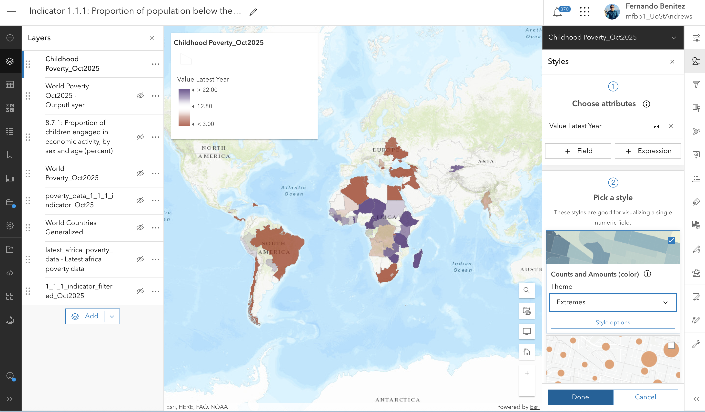{width="641"}

**Observation**: Already, you can see that more countries have reported data for poverty rates. ArcGIS Online offers an easy way to visualize and compare relationships where data is present.

10. Click **Done**.

------------------------------------------------------------------------

## Step 3: Compare Data to Find Patterns

### Task 3.1: Creating a Bivariate Map

1.  Hover over the **Childhood Poverty** layer and click *three dots*. In the menu, click **Duplicate**.

    **Result**: An identical layer is added to the map.

    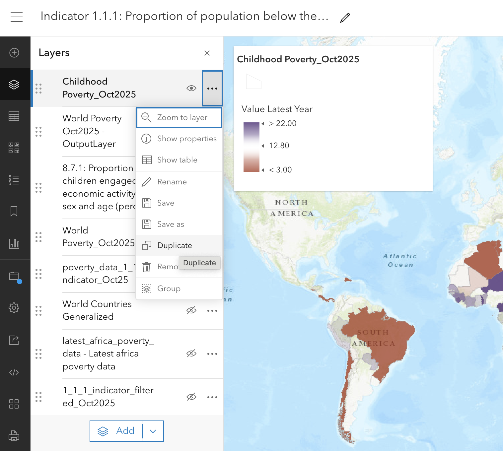

2.  Turn off the original layer, then open the **Style** pane for the **Childhood Poverty - copy**.

    **Current State**: The layer currently shows Value Latest Year from Indicator 8.7.1: Children engaged in economic activity. Now you'll add the Value Latest Year attribute from Indicator 1.1.1: Global poverty for comparison.

3.  Under **Choose an attribute**, click **Field** and choose **2017**.

    > **Question for Understanding**: Do you remember what that attribute represents and what layer it comes from?

4.  Scroll down in the **Pick a Style** options to **Relationship** and click to **Select it**. Then click **Done**.

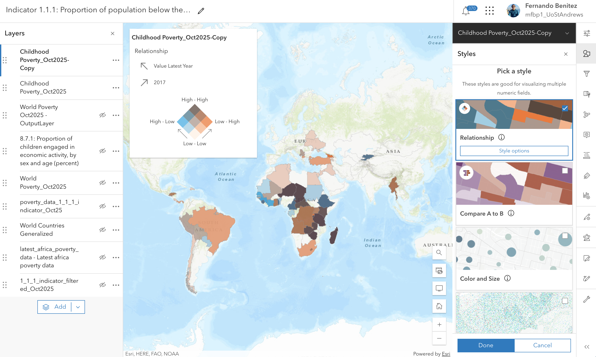

5.  Click **Style options** and choose a Symbol Style **blue-pink-purple color palette**. Click **Done**. Make sure **2017** is on top of **Value Lasted Year**.

    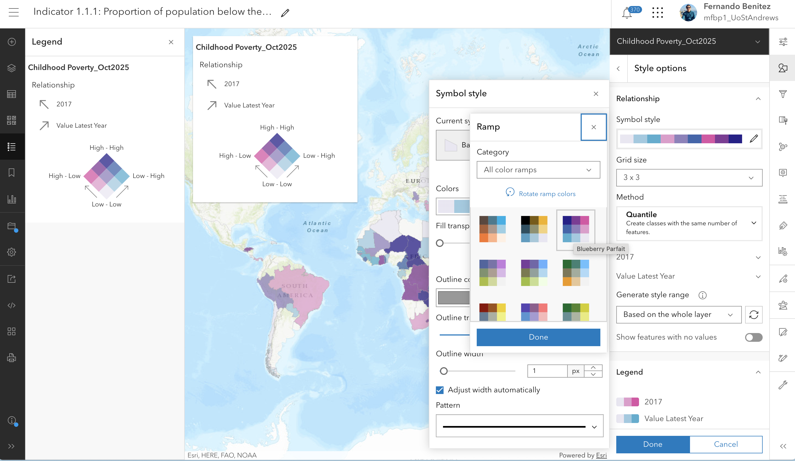

**Understanding Bivariate Maps**: The relationship symbology style is a way of creating **bivariate maps** that lets you easily compare two topics on a single map because only the countries with data for both indicators are shown.

### Task 3.2: Improving Data Labels and Pop-ups

6.  Click over the **Childhood Poverty - copy** layer and click the three-dots. In the **More Options** menu, click **Rename** and replace the default name with **Global Childhood Poverty**.

7.  Click **Pop-ups pane.**

    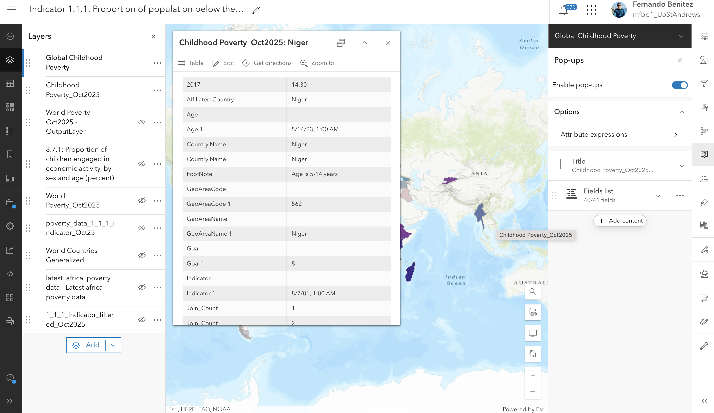

8.  Under **Pop-ups**, you have **Title** and **Fields List.**

    6.  Expand the **Field List** option, **remove everything** except for **Country Name, Value Latest Year, and 2017**.

        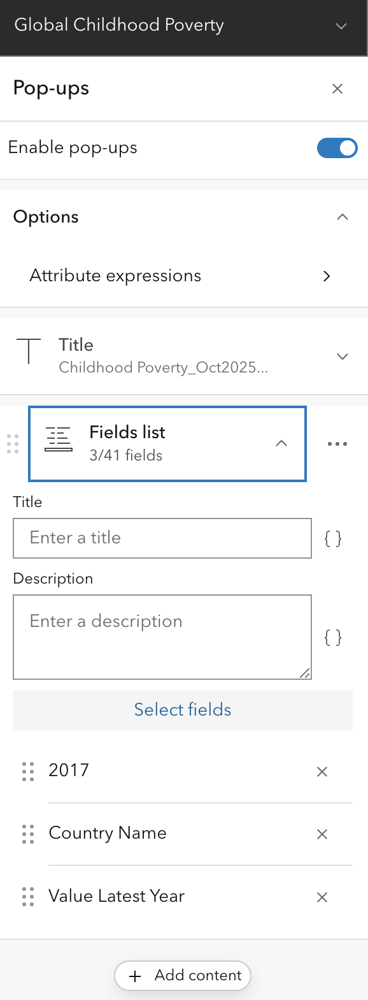{width="182"}

        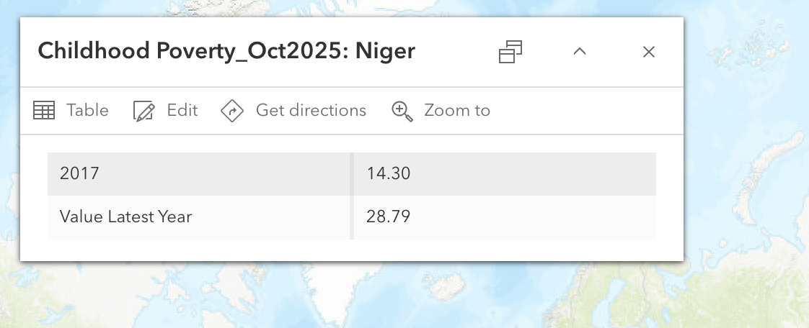

        6.  In the **Fields pane**:

            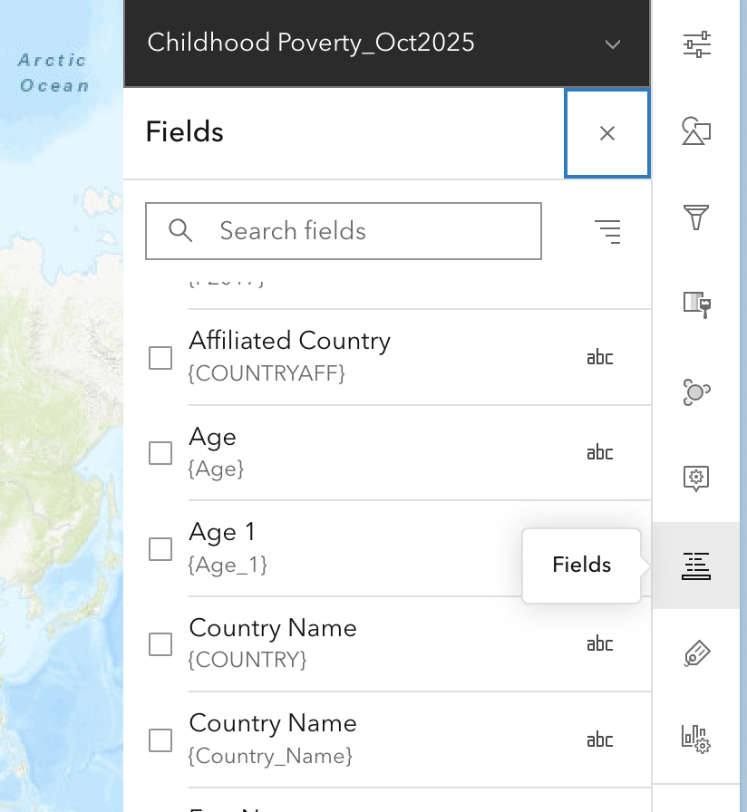{width="399"}

            -   Click **2017** and replace the Display Name for **Global Poverty**
            -   Scroll down, click **Value Latest Year** and replace it for **Engaged in Economic Activity**

**Result**: Now when you click on a country, the pop-up shows only those three attributes with clear, understandable names.

### Task 3.3: Analyzing the Legend and Patterns

11. At the left pane, click **Legend**.

    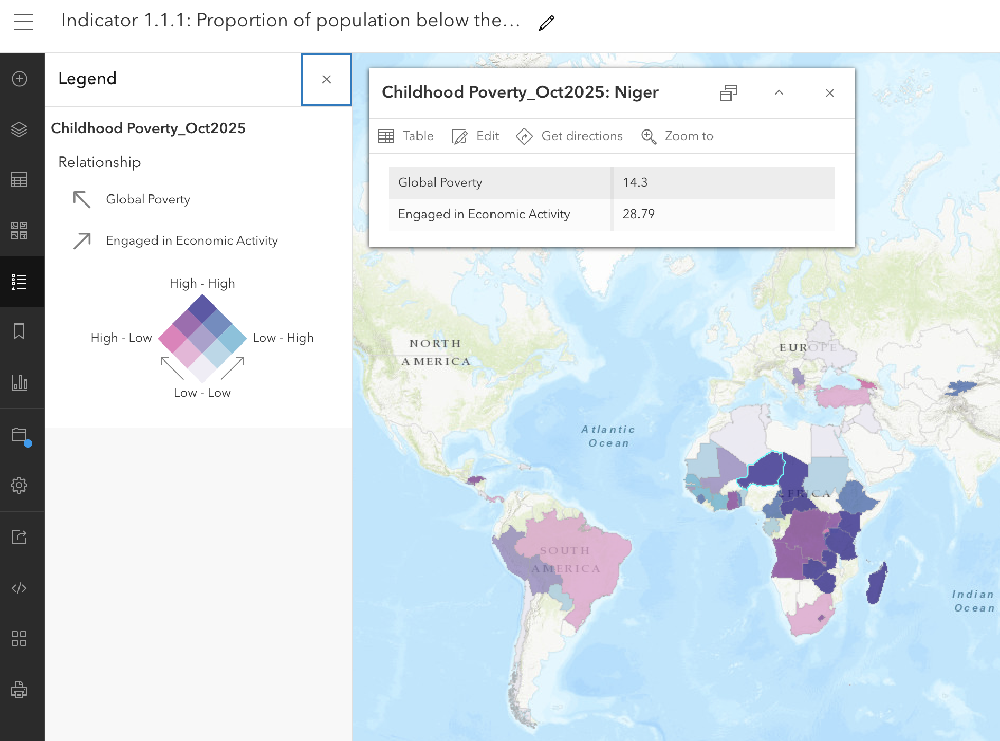

**Understanding the Legend**: The Legend pane shows the symbology for all the layers that are turned on, and your changes will be reflected here. By comparing the legend to the map, you can see the two extremes of the spectrum:

-   **Countries shaded purple** have a **high poverty rate** and **large proportions of children working** to support themselves or their families
-   **Countries in light pink** have **low poverty rates** and **small proportions of children at work**

**Complex Patterns**: In between there are countries with mixed patterns: - **Countries like Senegal** with relatively **low poverty rates** but **high proportions of children working** - **Countries like India** with **high poverty rates** but **small proportions of children contributing to the economy**

> **Scottish Example**: If we were to apply this analysis to Scotland at a regional level, we might find that: - **Urban areas like Edinburgh and Aberdeen** might show low poverty but some youth employment in service sectors - **Rural Highland areas** might show different patterns due to agricultural work and seasonal employment - **Post-industrial areas like parts of Glasgow or Dundee** might show higher poverty rates with different youth employment patterns

------------------------------------------------------------------------

## Questions and Policy Applications

If you toggle between layers in the Contents pane, the legend will help you perform more visual analysis on the countries. If you were looking at ways to base policy on this information, you could use the maps you created to answer the following questions (Make sure you add the response to the following questions to your data report):

### SDG 1: No-Poverty Questions

-   **Which countries have the highest poverty rates?**
-   **Where does it appear that children are protected from labor?**
-   **Where should international efforts to alleviate poverty be targeted?**
-   **Within individual countries, what are some ways of improving the situation for children facing challenges associated with poverty?**

### Questions related to Both Indicators

-   **Where do you see overlaps in patterns between the two maps that you have created for each indicator?**
-   **Where are the most affected areas that efforts should be focused toward helping improve the condition for children?**
-   **What sorts of place-based policies could be designed to help improve the conditions for children?**

> **Scottish Policy Examples**: Using similar spatial analysis techniques, Scottish policymakers in theory could:
>
> \- **Target the Scottish Child Payment** to areas with highest concentration of child poverty (using SIMD data)
>
> \- **Design place-based interventions** for areas like Inverclyde, West Dunbartonshire, or parts of Glasgow where multiple deprivation indicators overlap
>
> \- **Develop rural-specific policies** for Highland and Island communities where geographic isolation compounds poverty challenges
>
> \- **Create youth employment programs** in areas where high poverty correlates with limited economic opportunities for young people

------------------------------------------------------------------------

## Step 5: Share Maps to a Story Map (Optional step)

You now have three maps showing UN Sustainable Development Goals data. With a little extra work, you can share to a general audience the maps you have created in a way that everyone can understand.

-   **Embed the maps in a Story Map** using [Get Started with Story Maps](https://learn.arcgis.com/en/projects/get-started-with-story-maps/) Go to this link and replicate the steps to create a story map using the maps you have created in this lab. This step is optional.

------------------------------------------------------------------------

## Final Steps:

Well Done! You have now completed all the steps for this lab. Before moving on, make sure to:

1.  **Take one screenshot** of the final map. Ensuring your **full screen is visible**, including the **date and time**. This screenshot will be required for your report ( see all the instructions in the handbook)

2.  **For the Part B of this lab in your report. Replicate the process independently** by applying the same skills you practiced in this lab., as the data you are including here comes from the UN Data Portal you can replicate the lab using another indicator and different region or period of time.

In the original lab, you have created a set of maps showing UN Sustainable Development Goals data related to poverty. More importantly you learned **how to create a relationship map,** a method that help you to present two different indicators. For your **independent spatial analysis**, you can choose a different theme and dataset (e.g. healthcare access, education, environmental risk), as long as you also:

-   Use again **ArcGIS Online** using your university credentials. **Meet and work with your classmate to define which account want to use . You must only report one independent analysis results.**

-   Apply the same techniques learned in this lab., and create another relationship map.

-   Include the screenshot of the new relationship web map created with a **clear purpose** relevant to a real-world issue. Ensuring your **full screen is visible**, including the **date and time**. This screenshot will be required for your report.

This additional task is an opportunity to improve your technical skills, explore new datasets, and demonstrate your ability to adapt spatial analysis methods to new contexts.

------------------------------------------------------------------------

*Tutorial inspired on: [ArcGIS Online blog entry](https://www.esri.com/arcgis-blog/products/arcgis-online/mapping/examine-global-poverty-using-un-sustainable-development-goals/)*
